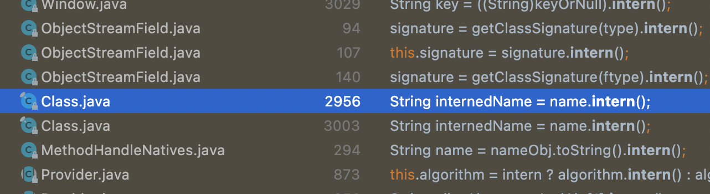

# Item11 : equals를 재정의하려거든 hashCode도 재정의하라
 
## Why?
> eqauls(Object)가 두 객체를 같다고 판단했다면, 두 객체의 hashCode는 똑같은 값을 반환해야 한다.

- eqauls를 재정의 하는 것은 두 인스턴스를 같은 객체로 판단하도록 재정의 하는 것이다.  
-  위 Object 명세를 지키기 위해서는 같은 객체는 같은 해시코드를 반환해야 한다.
- 하지만 Object의 기본 hashCode는 eqauls를 재정의 한 경우 두 객체를 전혀 다르다고 판단한다.

```java
Map<PhoneNubmer, String> m = new HashMap<>();
m.put(new PhoneNumber(707, 867, 5309), "제니");
m.get(new PhoneNumber(707,867, 5309))
```
위 코드의 결과로는 "제니"가 나와야 할 것 같지만 실제로는 null을 반환한다.
논리적 동치인 두 인스턴스에 대해서 서로다른 해시코드를 반환하는 것이다.
이런 Case를 방지하고 Object 명세를 지키기 위해서 __hashCode를 재정의해주어야 한다.__

## 올바른 hashCode란?
### 최악의 코드
```java
@Overrid
public int hashCode(){ return 42 }
```

- 위 코드는 동치인 모든 객체에서 똑같은 해시코드를 반환하니 적법하다.
- 하지만 평균 수행시간이 O(1)에서 O(n)으로 느려져서, 객체가 많아지면 도저히 쓸 수 없게 된다.
- 좋은 해시 함수라면 서로 다른 인스턴스에 다른 해시코드를 반환한다.

### hashCode를 작성하는 간단한 요령

>**ㄱ. 핵심 필드를 ㄴ.a 방법으로 계산한다**
>
>int result; 를 선언한 후 값 c로 초기화하는데, 이때  c는 핵심필드를 계산한 값>이다.
>
>**ㄴ. 객체의 나머지 핵심 필드에 대해 계산을 수행한다.**
>
>a. 해당 필드의 해시 코드를 계산한다.
>
>-   기본 타입 필드 : Type.hashCode(f) = Integer.hashCode(f);
>-   참조 타입 필드 + equals가 재귀적으로 호출 : hascode도 재귀적 호출  
 >   복잡할 것 같으면 표준형(canoical representation)을 만들어 그 표준형의 >hashCode를 호출한다.
>-   필드가 배열이면, 핵심원소 각가을 별도 필드처럼 다룬다. (Arrays.hashCode)
>
>b. ㄴ.a에서 계산한 해시코드로 갱신한다 : result = 31 * result + c
>
>**ㄷ. result를 반환한다.**
>

### hashCode를 구현한 모듈
-   Objects.hash()
    -  내부적으로 AutoBoxing이 일어나 성능이 떨어진다.
-   Lombok의 @EqualsAndHashCode
-   Google의 @AutoValue

## hashCode를 재정의할 때 주의해야 할 점

-  클래스가 불변이고 해시코드를 계산하는 비용이 크다면, 매번 새로 계산하기 보다는 캐싱하는 방식을 고려하자
   - 단 쓰레드 안전성을 고려해야한다.
- 성능을 높인답시고 hashcode를 계산할 떄 핵심필드를 생략해서는 안된다.
- hashCode가 반환하는 값의 생성규칙을 API사용자에게 자세히 공표하지 말자
    -   클라이언트가 hashcode값에 의지한 코드를 짜지 않고 추후에 바꿀 수도 있다.
    -   다음 릴리즈 시, 성능을 개선할 여지가 있다.

<br><br><br><br>

# Item 13 : clone 재정의는 주의해서 정의하라

## 1. Cloneable 인터페이스

### 1) 문제점

- Cloneable은 복제해도 되는 클래스임을 명시하는 믹스인 인터페이스
- Cloneable을 구현한다고해서 외부 객체에서 호출할 수 없음
    - clone 메서드가 선언된 곳이 Cloneable이 아닌 Object
    - protected로 선언되어 있음
- 리플랙션을 사용하는 방법도 있지만 보장하지는 않음

### 2) 역할

- Object의 protected 메서드인 clone의 동작 방식을 결정
- Cloneable을 구현한 클래스의 인스턴스에서 clone을 호출하면 복사한 객체를 반환
- 그렇지 않은 클래스의 인스턴스에서 호출하면 CloneNotSupportedException을 던짐

### 3) Cloneable의 모순

- 일반적으로 인터페이스를 구현한다는 것은 인터페이스에서 정의한 기능을 제공한다고 선언하는 행위
- Cloneable의 경우 상위 클래스에서 정의된 protected 메서드의 동작방식을 변경
- 실무에서는 Cloneable을 구현한 클래스는 clone 메서드를 public으로 제공하며, 사용자는 복제가 이루어짐을 기대
- 기대를 만족시키기 위해 생성자를 호출하지 않고 객체를 생성하는 모순적인 매커니즘이 만들어짐

## 2. Cloneable 구현

### 1) Object 명세 : Cloneable

[Object (Java Platform SE 7 )](https://docs.oracle.com/javase/7/docs/api/java/lang/Object.html#:~:text=hashCode()%2C%20HashMap-,clone,-protected%C2%A0Object%C2%A0clone)

- 관례상 super().clone으로 얻은 객체를 반환해야한다.
- super().clone 대신 생성자를 호출한 인스턴스를 반환하더라도 컴파일 시에 문제가 되지 않지만, 해당 클래스를 다시 상속받은 클래스에서 super().clone을 호출하면 잘못된 객체가 반환된다.

### 2) 제대로된 Cloneable 구현하기

> 모든 필드가 기본 타입 또는 불변 객체를 참조하는 경우
> 

```java
@Override 
public PhoneNumber clone() {
	try {
		return (PhoneNumber) super.clone();
	} catch (CloneNotSupportedException e) {
		throw new AssertionError();
	}
}
```

- 자바는 공변 반환 타이핑(convariant return type)을 지원하기 때문에 권장하는 방식
    - 공변 변환 타입 : 리턴 타입은 서브 클래스 범위에서 다양할 수 있음
- 쓸데없는 복사를 지양한다는 관점에서 불변 객체는 clone 메서드를 제공하지 않는게 좋다.

> 필드가 가변 객체를 참조하는 경우
> 

```java
@Override
public Stack clone() {
	try {
		Stack result = (Stack) super.class();
		result.elements = elements.clone(); // 가변 필드르 재귀적으로 호출
		return result;
	} catch (CloneNotSupportedException e) {
		throw new AssertionError();
	}
}
```

- clone은 원본 객체에 아무런 영향을 끼치지 않는 동시에 복제된 객체의 불변식을 보장해야함
- 가변 객체를 참조하는 경우 clone을 재귀적으로 호출하는 방법이 있음
- 가변 객체가 final로 선언되어 있다면 위 방식은 동작하지 않음
    - Cloneable 아키텍처는 ‘가변 객체를 참조하는 필드는 final로 선언하라'는 일반 용법과 충돌
    - 복제할 수 있는 클래스를 만들기 위해 일부 필드에서 final 한정자 제거

> 복잡한 가변 객체를 참조하는 경우
> 

```java
public class HashTable implements Cloneable {
    private Entry[] buckets = ...;

    private static class Entry {
        final Object key;
        Object value;
        Entry next;

        Entry(Object key, Object value, Entry next) {
            this.key = key;
            this.value = value;
            this.next = next;
        }

        // 방법 1 : 스택 오버 플로우 발생할 수 있음
        Entry deepCopy() {
            return new Entry(key, value
                next == null ? null : next.deepCopy());
        }
        
        // 방법 2 : 반복자를 사용한 방법
//        Entry deepcopy() {
//            Entry result = new Entry(key, value, next);
//            for (Entry p = result; p.next != null; p = p.next)
//                p.next = new Entry(p.next.key, p.next.value, p.next.next);
//            return result;
//        }
    }

    @Override
    public HashTable clone() {
        try {
            HashTable result = (HashTable) super.clone();
            result.buckets = new Entry[buckets.length];
            for (int i = 0; i < buckets.length; i++)
                if (buckets[i] != null)
                    result.buckets[i] = buckets[i].deepCopy(); // 연결리스트를 재귀적으로 복사
            return result;
        } catch (CloneNotSupportedException e) {
            throw new AssertionError();
        }
    }
}
```

- 복잡한 가변 객체의 경우 복잡한 객체 내부에 깊은 복사를 위한 메서드를 정의하는 방법이 있음
- 위 예에서 Entry 객체는 deepCopy() 메서드를 호출해  연결된 객체를 재귀적으로 호출해 Entry 객체를 생성해 반환한다.

> 고수준 API를 활용한 방법
> 
- super.clone 호출을 통해 얻은 객체의 모든 필드를 초기 상태로 설정하고, 원본 객체의 상태를 다시 생성하는 고수준 메서드 호출
- 보통은 간단하고 우아한 코드를 작성할 수 있음
- 저수준 코드 보다 느릴 수 있음
- Cloneable 아키텍처의 기초가 되는 필드 단위 객체 복사를 우회하는 방식으로 어울리지 않을 수 있음

## 3. clone 메서드 재정의 시 유의 사항

- 재정의될 수 있는 메서드를 호출하지 않는다.
    - 하위 클래스에서 재정의한 메서드를 호출하면 하위 클래스는 복제 과정에서 자신의 상태를 교정할 기회를 잃어 원본과의 상태가 달라질 가능성이 큼
    - 따라서 private 또는 final로 선언된 메서드이어야 한다.

- 재정의한 clone()는 CloneNotSupportedException을 던지지 않는다.
    - public인 clone() 메서드는 thorws 절을 없애야 한다.
    - 검사 예외를 던지지 않아야 사용하기 편하다.
    
- 상속용 클래스는 Cloneable을 구현하지 않는다.

- clone을 퇴화시키는 방법도 고려해본다.
    
    ```java
    @Override
    protected final Object clone() throws CloneNotSupportedException {
    	throw new CloneNotSupportedException();
    }
    ```
    

- Cloneable을 구현한 [Thread-safe](https://dheldh77.tistory.com/entry/%EC%9A%B4%EC%98%81%EC%B2%B4%EC%A0%9C%EB%A9%80%ED%8B%B0%ED%94%84%EB%A1%9C%EC%84%B8%EC%8A%A4%EC%99%80-%EB%A9%80%ED%8B%B0%EC%8A%A4%EB%A0%88%EB%93%9C) 클래스를 작성할 때는 clone 메서드를 적절히 동기화해줘야 한다.

## 4. 요약

- Cloneable을 구현하는 모든 클래스는 clone을 재정의해야 한다.
- 접근 제한자는 public, 반환 타입은 클래스 자신이다.
- super.clone을 호출한 후 필요한 필드를 적절히 수정한다.
- 모든 가변 객체를 복사한다.(주로 재귀적으로 clone을 호출하지만 항상 적절한 것은 아니다)

## 5. 변환 생성자와 변환 팩터리

- 변환 생성자와 변환 팩터리 방식으로 더나은 객체 복사 방식을 제공할 수 있다.

> 변환 생성자와 변환 팩터리 방식의 이점
> 
- 생성자를 쓰지 않는 방식을 사용하지 않는다.
- 규약에 기대지 않는다.
- 정상적인 final 필드 용법과 충돌하지 않는다.
- 불필요한 검사 예외를 던지지 않는다.
- 형변환이 필요없다.
- 인터페이스 타입의 인스턴스를 받을 수 있다.
- 클라이언트는 원본의 구현 타입에 얽매이지 않고 복제본의 타입을 직접 선택할 수 있다.

> 복사 생성자
> 

```java
public Yum(Yum yum) { ... };
```

> 복사 팩터리
> 

```java
public static Tum newInstance(Yum yum) { ... };
```

<br><br><br><br>


# Item14 : `Comparable`을 구현할지 고려하라
`compareTo` 는 `Comparable` 인터페이스에 유일하게 존재하는 method 이다.

```java
public interface Comparable<T> {
    /**
     * Compares this object with the specified object for order.  Returns a
     * negative integer, zero, or a positive integer as this object is less
     * than, equal to, or greater than the specified object.
	   ... 
     * @param   o the object to be compared.
     * @return  a negative integer, zero, or a positive integer as this object
     *          is less than, equal to, or greater than the specified object.
     *
     * @throws NullPointerException if the specified object is null
     * @throws ClassCastException if the specified object's type prevents it
     *         from being compared to this object.
     */
    public int compareTo(T o);
}
```

> `Compares this object with the specified object for order.`
> 
>
> `throws ClassCastException if the specified object's type prevents it from being compared to this object.`
> 

모든 객체에 대해 전역 동치관계를 부여하는 `equals`와 달리 `compareTo` 메소드는 타입이 다른 객체를 신경 쓰지 않아도 된다. 타입이 다른 객체가 주어지면 간단히 `ClassCastException`을 던져도 되며 대부분 그렇게 사용한다. 물론 다른 타입 사이 비교도 허용한다.

```java
public final class Integer extends Number implements Comparable<Integer> {
    /**
     * A constant holding the minimum value an {@code int} can
     * have, -2<sup>31</sup>.
     */
    @Native public static final int   MIN_VALUE = 0x80000000;
		...
```

`String`, `Integer` 와 같이 값을 값는 모든 객체와 `Enum` 타입은 `Comparable`을 구현한 객체이다.

```java
@Test
void compareTo_음수가_나온다() {
    Integer a = 1;
    Integer b = 2;
		assertThat(a.compareTo(b)).isNegative();
		assertThat(a.compareTo(b)).isEqualTo(-1);
}

@Test
void compareTo_양수가_나온다() {
    Integer a = 2;
    Integer b = 1;
		assertThat(a.compareTo(b)).isPositive();
		assertThat(a.compareTo(b)).isEqualTo(1);
}
```

>`sgn`은 표현식이며 부호 함수를 의미 (음수, 양수, 0)
>
> `Comparable`을 구현한 클래스는 모든 x, y에 대해 `sgn(x.compareTo(y)) == -sgn(y.compareTo(x))`이어야 한다.
>
>`Comparable`을 구현한 클래스는 모든 z에 대해 `x.compareTo(y) == 0` 이면 `sgn(x.compareTo(z)) == sgn(y.compareTo(z))`다.
>
>`Comparable`을 구현한 클래스는 추이성을 보장한다.
>`x.compareTo(y) > 0 && y.compareTo(z) > 0`가 성립하면 `x.compareTo(z) > 0`도 성립한다.
>
>(권고사항) `(x.compareTo(y)) == 0 == (x.equals(y))` 이 코드를 지키지 못하면 명시해야 한다.
> 

- (참고) `String str = “”, new String(””)` 차이?
    
    • new String()은 새로운 객체를 만드는 것으로 `heap area`에 저장이 되고, String str = ""; 처럼 리터럴을 이용한 변수 할당은,`string constant pool`영역에 저장되기 때문에 서로 잠조하고 있는 레퍼런스 주소가 다르다.
    
    • 리터럴로 스트링을 생성한다면, 내부적으로 `intern()`이라는 메소드가 실행되면서, `string constant pool`를 한번 훑고 기존에 존재하는 string값이 있으면, 그 값의 레퍼런스 주소를 할당받고, 없으면 새로 생성한 뒤 그 주소를 받도록 한다.
    
    ```java
    
    @Test
        public void testNewInstanceFirst() {
            System.out.println("testNewInstanceFirst");
            // new
            String a = new String("ssafy");
            String b = new String("ssafy");
            int a_addr = System.identityHashCode(a);
            int b_addr = System.identityHashCode(b);
            System.out.println("a : " + a_addr);
            System.out.println("b : " + b_addr);
            System.out.println();
            assertNotEquals(a_addr, b_addr);
            // leteral
            String c = "ssafy";
            String d = "ssafy";
            int c_addr = System.identityHashCode(c);
            int d_addr = System.identityHashCode(d);
            System.out.println("c : " + c_addr);
            System.out.println("d : " + d_addr);
            System.out.println();
            assertEquals(c_addr, d_addr);
            // intern
            String e = b.intern();
            System.out.println("e : " + System.identityHashCode(e));
        }
    ```
    
    
    

### `compareTo`는 동치인지 비교하는게 아니라 그 순서를 비교한다.

만약 객체 참조의 필드를 비교하고자 한다면 재귀적으로 `compareTo` 를 호출해야 한다. 만약 `Comparable` 을 구현하지 않았다면 `Comparator` 를 사용한다. 

```java
class PhoneNumber {
	public int compareTo(PhoneNumber pn) {
		int result = Short.comparable(areaCode, pn.areaCode); // 가장 먼저 비교할 필드
		if (result == 0) {
			result = Short.compare(prefix, pn.prefix); // 두번째로 비교할 필드
			if (result == 0) {
				result = Short.compare(lineNum, pn.lineNum); // 세번째로 비교할 필드
			}
		}
		return result;
	}
}
```

> 일단, 두 인터페이스를 구체적으로 알아보기에 앞서 먼저 정답부터 말하자면, Comparable은 **"자기 자신과 매개변수 객체를 비교"**하는 것이고, Comparator는 **"두 매개변수 객체를 비교"**한다는 것이다.
>
>쉽게 말하자면, Comparable은 자기 자신과 파라미터로 들어오는 객체를 비교하는 것이고, Comparator는 자기 자신의 상태가 어떻던 상관없이 파라미터로 들어오는 두 객체를 비교하는 것이다. 즉, **본질적으로 비교한다는 것 자체는 같지만, 비교 대상이 다르다는 것**이다.
>
>또 다른 차이점이라면 Comparable은 lang패키지에 있기 때문에 import 를 해줄 필요가 없지만, Comparator는 util패키지에 있다.
>
>**둘다 반드시 overriding 해줘야 한다.**
>
>[https://st-lab.tistory.com/243](https://st-lab.tistory.com/243)
> 

```java
class PhoneNumber {
	private static final Comparator<PhoneNumber> COMPARATOR =
		comparingInt((PhoneNumber pn) -> pn.areaCode)
			.thenComparingInt(pn -> pn.prefix)
			.thenComparingInt(pn -> pn.lineNum);

	public int compareTo(PhoneNumber pn) {
		return COMPARATOR.compare(this, pn);
	}
}
```

Java 의 type 추론 능력이 뛰어나지 않기 때문에 (`PhoneNumber pn`) 와 같이 명시할 필요가 있다.
첫 번째 비교인 `comparingInt` 가 진행되고 다음 비교 인자를 비교하기 위해 `thenComparingInt` 를 사용하여 그 다음 변수를 비교하고, 한번 더 그 다음 변수를 비교한다.

그런데 두개의 매개변수를 받아 정렬을 해야 하는 경우가 있다.

```java
Arrays.sort(people, new Comparator<int[]>() {
    @Override
    public int compare(int[] o1, int[] o2) {
      return o1[0] == o2[0] ? o1[1] - o2[1] : o2[0] - o1[0];
    }
});
```

```java
Arrays.sort(people, (o1, o2) -> o1[0] == o2[0] ? o1[1] - o2[1] : o2[0] - o1[0]);
```

`o1`, `o2` 에 대한 범위가 명시되어 있으니 문제가 없지만 만약 값이 int 범위를 넘거나 매개변수가 `int`가 아닌 소수점이 들어온다면?

**즉, 정수 overflow를 일으키거나, IEEE754 부동 소수점 계산에 따른 오류가 발생할 수 있다.**

```java
Arrays.sort(people, (o1, o2) -> Objects.equals(o1[0], o2[0]) ?
        Integer.compare(o1[1], o2[1]): Integer.compare(o2[0], o1[0]);
```


<br><br><br><br>
# Item15 : 클래스와 멤버의 접근권한을 최소화하라

> 잘 설계된 컴포넌트는 모든 내부 구현을 완벽히 숨겨, 구현과 API를 깔끔히 분리한다. 

## WHY
정보 은닉, 캡슐화를 통해서 얻을 수 있는 장점이 많다. 그 중 대부분은 시스템을 구성하는 컴포넌트들을 서로 독립시켜서 개발,테스트, 최적화, 적용, 분석, 수정을 개별적으로 할 수 있게 해주는 것과 연관 되어 있다.

### 정보은닉의 장점
- 시스템 개발 속도를 높인다 
    - 여러 컴포넌트 병렬 개발 가능

-  시스템 관리 비용을 낮춘다 
    - 각 컴포넌트를 더 빨리 파악해 디버깅 가능 
    - 컴포넌트 교체 비용 하락

-  성능 최적화에 도움이 된다 
     - 완성된 시스템을 프로파일링해 해당 컴포넌트만 최적화 할 수 있다.  

-  소프트웨어 재사용성을 높인다 
    - 의존성이 낮은 독자적인 컴포넌트는 낯선 환경에서도 유용하게 쓰일 수 있다.
-  큰 시스템을 제작하는 난이도를 낮춘다       
    - 개별 컴포넌트 동작 검증 가능


## 정보 은닉의 기본 원칙
접근 제한자(JAVA)

> 모든 클래스와 멤버의 접근성을 가능한 한 좁혀야 한다.

1. 톱레벨 클래스는 public 또는 package-private를 선언하자.

- 외부로 API로서 제공해야 하는 클래스는 `public` 으로, 패키지 외부에서 쓰이지 않는 다면 `package-private`으로 선언하자.
- public으로 선언하면 API가 되므로 영원히 관리해줘야만 한다.

2. 클래스의 공개 API를 설계한 후 그외의 모든 멤버는 private로 만들자.

- 오직 같은 패키지의 다른 클래스가 접근해야 하는 멤버에 한하여 pavkage-private으로 풀어주자.
- public 클래스에서 protected로 바뀌는 순간 그 멤버에 접근할 수 있는 대상 범위가 엄청나게 넓어진다.
    - protected 멤버의 수는 적을수록 좋다. (공개 API이므로 영원히 관리해야 한다.)

3. public 클래스의 인스턴스 필드는 되도록 public이 아니어야 한다.

- final이 아닌 인스턴스 필드를 public으로 선언하게되면 불변식을 보장할 수 없게된다.
- public 가변필드를 갖는 클래스는 일반적으로 스레드 안전하지 않다.
- 단, 꼭 필요한 구성요소로써의 상수는 public static final 필드로 공개하자.
 - 단 배열은 보안 허점이 존재하니 public 필드를 사용하지 않도록 하자.
    - 꼭 제공하고 싶을때는 unmodifiableList를 사용
    - 또는 clone(방어적 복사)를 사용하자

1) unmodifiableList
 ```java
private static final Thing[] PRIVATE_VALUES = {...};

public static final List<Thing> VALUES = Collections.unmodifiableList(Arrays.asList(PRIVATE_VALUES));
```

   2. clone(방어적 복사) 사용
 

```java
public static final Thing[] values() {
  return PRIVATE_VALUES.clone();
}
```

## JAVA9 에서 도입된 모듈 개념
> class의 묶음 = 패키지
> 패키지의 묶음 = 모듈

모듈 시스템 개념이 도입되면서 두 가지 암묵적 접근 수준이 추가되었다.

- 모듈은 공개(export)할 것들을 선언한다.

- protected 혹은 public 멤버라도 해당 패키지를 공개하지 않았다면 모듈 외부에서는 접근할 수 없다.

- public, protected 수준의 효과가 모듈 내부로 한정된다.
